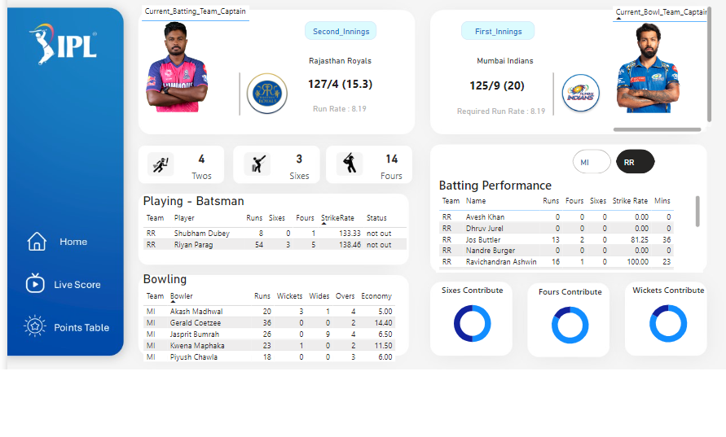
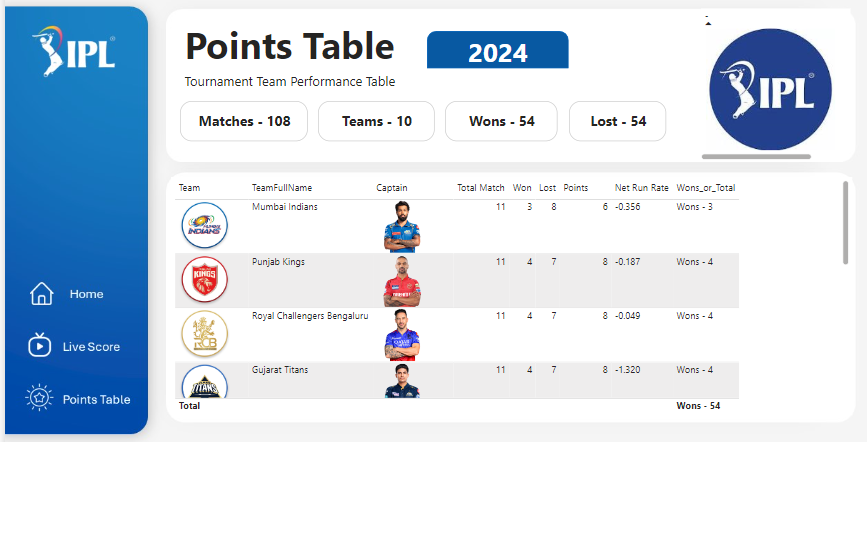

# IPL_2024

## Introduction
I worked on visualizing IPL 2024 datasets in Power BI, where I transformed raw data into insightful visual representations. The project focused on showcasing athlete performance and player summaries, offering a clear and dynamic view of the IPL season's key metrics.

## Visualization
 - LIVE SCORE IPL

 - POINTS TABLE IPL

## Visualization Tool Used 
 - Power BI

## Dataset Used
 - https://github.com/DewanjaliKapse/IPL_2024/blob/main/Athletes.csv
 - https://github.com/DewanjaliKapse/IPL_2024/blob/main/Cleaned_IPL_Player_Summary_With_Img.csv
